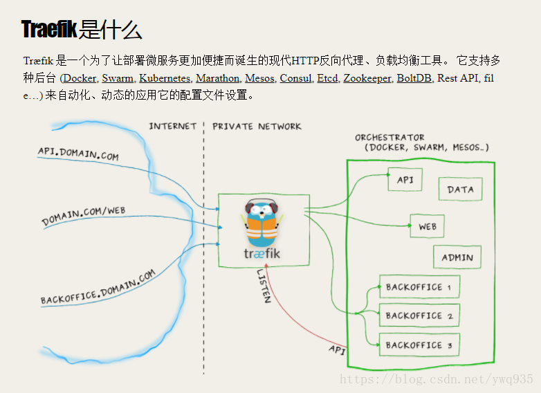

## K8S 部署

### 工具和镜像
1. 工具版本：
etcd-v3.1.10-linux-amd64.tar.gz 
kubeadm-1.9.0-0.x86_64.rpm 
kubectl-1.9.0-0.x86_64.rpm 
kubelet-1.9.9-9.x86_64.rpm 
kubernetes-cni-0.6.0-0.x86_64.rpm 
socat-1.7.3.2-2.el7.x86_64.rpm 

2. docker离线镜像：
etcd-amd64_v3.1.10.tar 
k8s-dns-dnsmasq-nanny-amd64_v1.14.7.tar 
k8s-dns-kube-dns-amd64_1.14.7.tar 
k8s-dns-sidecar-amd64_1.14.7.tar 
kube-apiserver-amd64_v1.9.0.tar 
kube-controller-manager-amd64_v1.9.0.tar 
kube-proxy-amd64_v1.9.0.tar 
kubernetes-dashboard_v1.8.1.tar 
kube-scheduler-amd64_v1.9.0.tar 
pause-amd64_3.0.tar 

### 概念
1. apiserver master :集群核心，负责各个组件通讯，安全控制
2. etcd : 集群数据中心，存放集群配置，状态信息。数据丢失，集群无法恢复
3. kube-controller-manager:控制器（内部自选举）集群状态管理器，一个pod
死掉，会新建一个pod恢复原状态。默认情况下只有一个节点处于活跃。
4. kublet：将agent node 注册到apiserver
5. kube-proxy：每个node上一个，负责service vip到 endpoint pod（运行中的pod）
的流量转发

[两master节点K8S部署](https://blog.csdn.net/ywq935/article/details/79856469)

1. 关闭防火墙，selinux，swap
2. 内核开启网络支持
3. 配置keepalived
4. 配置etcd
    1.  配置环境变量
    2.  创建ca和证书和密钥
    
5. 安装etcd
6. 安装docker
7. 安装kubelet、kubectl、kubeadm、kubecni
8. kubeadm初始化
9. 安装网络插件 kube-router

### k8s 对外服务暴漏
1. Load Blance
2. Node port
3. Ingress   包含三个组件
     1. reverse proxy LB  反向代理，代理请求到后端服务的endpoint pod
     2. ingress controller   监控路由变化（apiserver上的svc（service）关联关系变化）
     3. k8s ingress  k8s的一种资源类型，相当于到服务的路由表。

#### traefik

> traefik 相当于代替了reverse proxy LB 和 ingress controller

[利用trafik服务部署简单的nginx应用容器](https://blog.csdn.net/ywq935/article/details/79886793)

### Kubernetes1.16下部署Prometheus+node-exporter+Grafana+AlertManager 监控系统
[部署文档地址](https://www.cnblogs.com/jiangwenhui/p/11989470.html)

---
#
#
<meta http-equiv="refresh" content="5">
